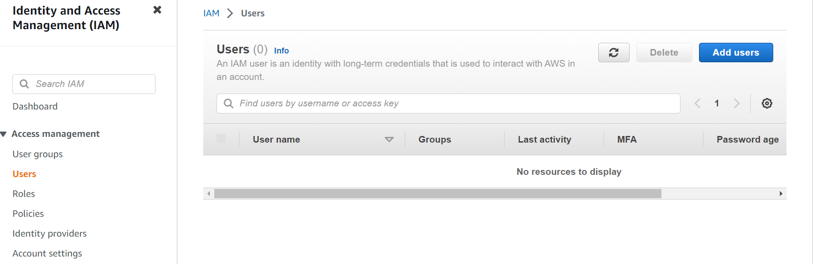

# IAM
#### Here are the step-by-step instructions on how to create an IAM user in AWS using the AWS Management Console

Sign in to the AWS Management Console using your root account or an IAM user with the appropriate permissions.

In the navigation menu, choose "Services" and then select "IAM". This will take you to the IAM dashboard.

In the navigation menu, choose "Users". This will show you a list of all the existing IAM users.

On the Users page, choose the "Add user" button. This will take you to the "Add user" page.

In the "Add user" page, enter a name for the new user in the "User name" field.

Select the type of access for the new user. If you want the user to have access to the AWS Management Console, select "AWS Management Console access". If you want the user to have programmatic access, select "Programmatic access".

If you selected "AWS Management Console access", you will be prompted to set a password for the user. You can also choose to have AWS generate a random password for you.

If you selected "Programmatic access", you will be prompted to create an access key for the user. An access key consists of an access key ID and a secret access key, which are used to make programmatic requests to AWS services.

In the "Permissions" section, you can either add the user to an existing group, or create a new group with specific permissions. You can also give the user permissions by attaching policies directly to the user.

On the review page, you can review the user's name, access type, permissions, and password or access key. When you're ready, choose "Create user".
